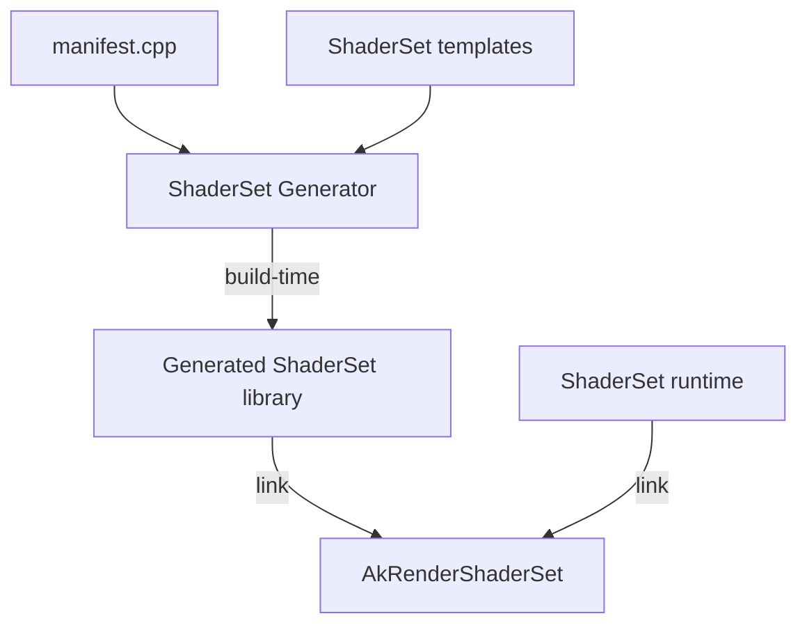

# AkRender ShaderSet

ShaderSet is AkRender's shader build system. Users describe a shader set in a C++
**manifest** file; CMake compiles and runs the generator at build time, producing
an embeddable library target with a virtual file system, compile-time shader
descriptors, and optional build-time Slang → SPIR-V compilation.

## Architecture



## Packages

ShaderSet ships as an independent CMake package:

| Target | Purpose |
|--------|---------|
| `AkRenderShaderSet::AkRenderShaderSet` | Runtime: VFS, shader descriptors, `ShaderSetRuntime` |
| `AkRenderShaderSet::AkRenderSlangJIT` | Runtime Slang JIT compilation |
| `add_shader_set()` (from `ShaderSetGenerator.cmake`) | Offline manifest → generated library |

```cmake
find_package(AkRenderShaderSet REQUIRED)

add_shader_set(my_shaders path/to/manifest.cpp)
target_link_libraries(my_app PRIVATE
    my_shaders
    AkRenderShaderSet::AkRenderShaderSet
)
```

`find_package(AkRender)` provides the renderer library only. Shader build
integration requires `find_package(AkRenderShaderSet)` separately.

## Writing a manifest

A manifest source must:

1. Define `AkRender::ShaderSetGenerator::make_manifest()`
2. End with `#include <AkRender/ShaderSetGenerator/ManifestEntry.inc>`

Paths in the manifest resolve relative to the manifest file's directory.

### File embedding example

See `tests/GeneratorExample/manifest.cpp`:

```cpp
#include <AkRender/ShaderSetGenerator/Manifest.hpp>
#include <AkRender/ShaderSetGenerator/ManifestRegister.hpp>

namespace AkRender::ShaderSetGenerator {

Manifest make_manifest()
{
  Manifest manifest;

  open(manifest)
      | file_at("example_data", {"binary-resource.txt"},
                Config::VirtualPath{"/example_data"})
      | register_all();

  return manifest;
}

} // namespace AkRender::ShaderSetGenerator

#include <AkRender/ShaderSetGenerator/ManifestEntry.inc>
```

### Slang compilation example

See `tests/ShaderCompileExample/manifest.cpp`:

```cpp
#include <AkRender/ShaderSetGenerator/Manifest.hpp>
#include <AkRender/ShaderSetGenerator/ManifestRegister.hpp>

using AkRender::ShaderSet::Stage;

namespace AkRender::ShaderSetGenerator {

Manifest make_manifest()
{
  Manifest manifest;

  open(manifest)
      | module("math")
            .sources({"shaders/math_utils.slang"})
            .import_as("math_utils")
      | slang("triangle_vert")
            .source("shaders/triangle.slang")
            .entry("vsMain")
            .stage(Stage::Vertex)
            .ir()
            .uses("math")
      | slang("triangle_frag")
            .source("shaders/triangle.slang")
            .entry("fsMain")
            .stage(Stage::Fragment)
            .spirv()
            .uses("math")
      | build();

  return manifest;
}

} // namespace AkRender::ShaderSetGenerator

#include <AkRender/ShaderSetGenerator/ManifestEntry.inc>
```

The generator compiles Slang modules and shaders at build time, embeds the
outputs into the generated library, and exposes `constexpr` descriptors for
runtime lookup and optional JIT compilation.

## Generated outputs

For `add_shader_set(<name> <manifest.cpp>)`, CMake writes into
`${CMAKE_CURRENT_BINARY_DIR}/<name>/`:

| File | Purpose |
|------|---------|
| `<name>.hpp` / `<name>.cpp` | Generated ShaderSet library sources |
| `<name>.d` | Depfile for incremental Slang rebuilds |

The `<name>` target is a static library that links `AkRenderShaderSet` and can be
linked into application targets directly.

## Tests

When `AKRENDER_SHADER_BUILD_TEST` is ON (default), unit tests and the example
manifests above are built as part of the AkRender configure step:

```bash
cmake --preset debug
cmake --build --preset debug
ctest --test-dir build/debug
```
